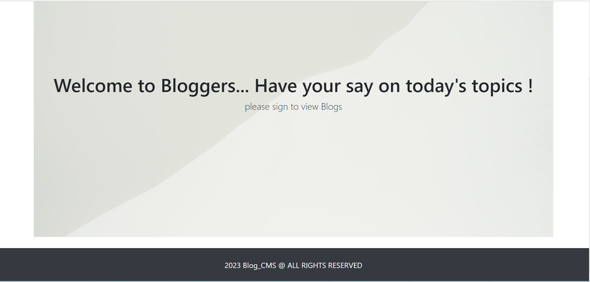
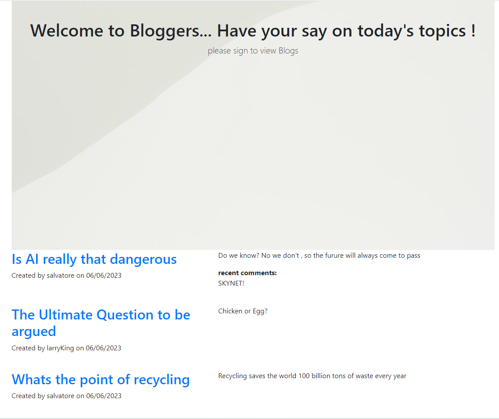
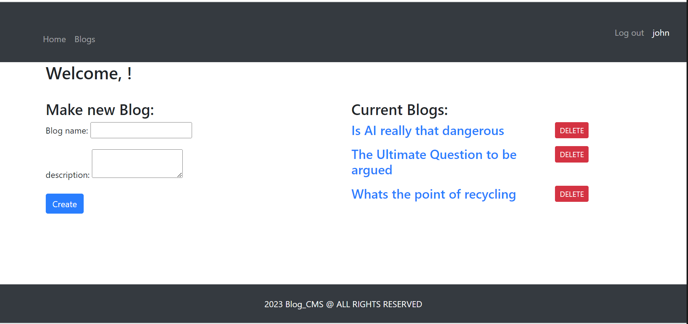
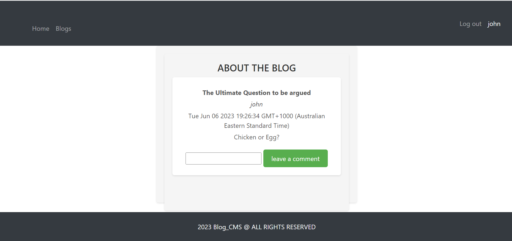

# Bloggers
  

   
  

  ## Description
  This Blog site allows you to interact with other people through Blogs, you are able to create and delete blogs and also comment on other peoples blogs with one simple click
  

   

## License
  
    Copyright 2023 Andy316C Licensed under the Apache License, Version 2.0 (the 'License'); you may not use this file except in compliance with the License. You may obtain a copy of the License at http://www.apache.org/licenses/LICENSE-2.0 Unless required by applicable law or agreed to in writing, software distributed under the License is distributed on an 'AS IS' BASIS, WITHOUT WARRANTIES OR CONDITIONS OF ANY KIND, either express or implied. See the License for the specific language governing permissions and limitations under the License.

   
  
  ## Table of contents
  <ol>
  <li><a href='#title'>Title</a></li>
  <li><a href='#desc'>Description</a></li>
  <li><a href='#install'>Installation</a></li>
  <li><a href='#cont'>Contribution</a></li>
  <li><a href='#test'>Testing</a></li>
  <li><a href='#images'>Images</a></li>
  <li><a href='#questions'>Questions</a></li>
  <li><a href='#contact'>Contact Info</a></li>
  </ol>
   

  

  ## Installation
  The application required multiple npm packages for successfull deployment, the pacakages required were express to send/receive the request and mysql2 to connect to the database to store the blog data, bcrypt for encrypting of passwords when signing up. express-handlebars for the HTML template and express-sessions for session storage.

  

   

  

  ## Contribution Guidelines
  Updates to adding Comments only
  

   

  

  ## Testing
You will need to sign in to view the Blogs, after signing in or signing up and creating an account you will have access to the Blogs, there you are able to comment on other peoples blogs and even create your own blogs.

 
  

   
   

  ## Images
  Before signing up
  
   

  After signing up
  
   
  
  Creating a blog or Deleting a blog
 
   

  Adding a comment
  
   
  
  

   
  
  

  
  ## Questions
  
  For questions or information please Email the following email address with your questions or concerns.
   

  Company Name: 
  Global Software CMS INC
   

  Company Email:  
  GlobalSoftwareCMSINC@gmail.com
  

   

  
  ## Contact Info
  Developers Name:  
  Andrew Clark
   

  Developers Email:  
  andy@gmail.com

  

   

 

## Screencastify video link

Click below for the video:

<a href= "https://bloggerblogscms.herokuapp.com/">Blog Site </a>

   

  
